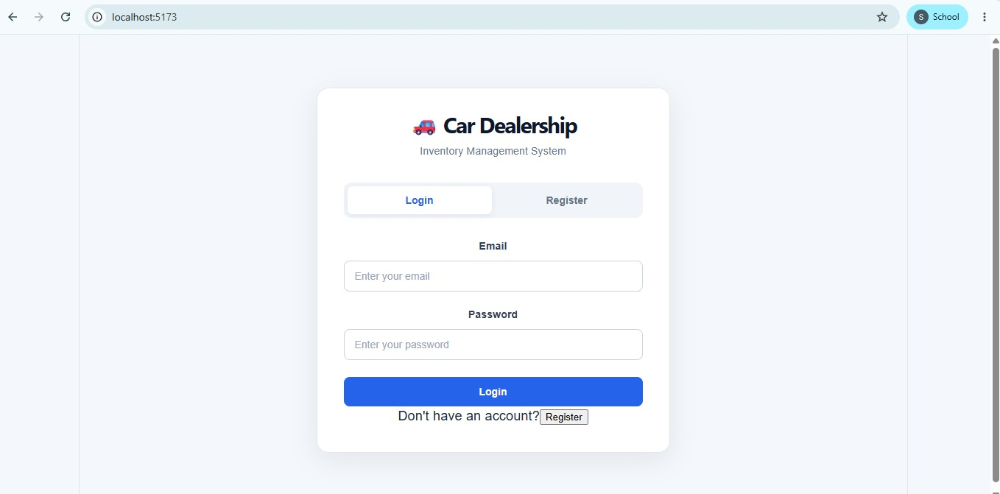
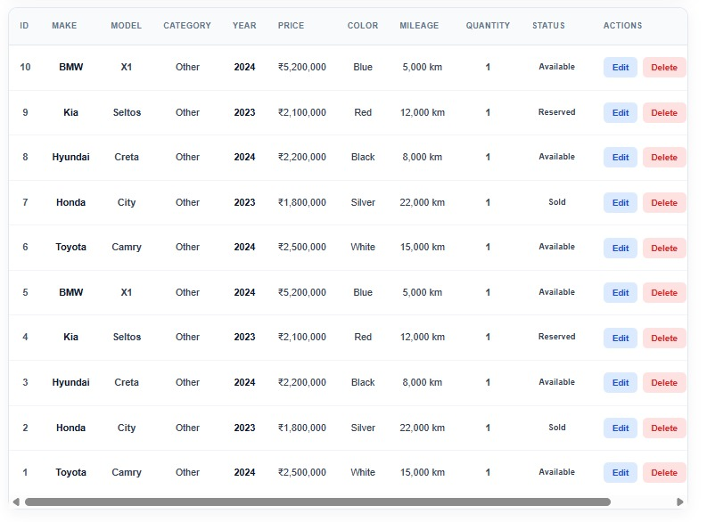
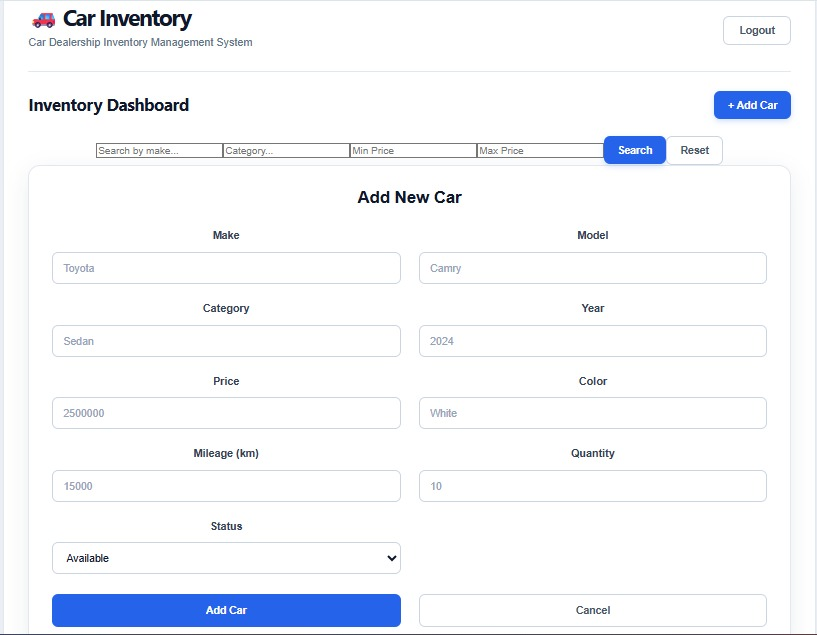
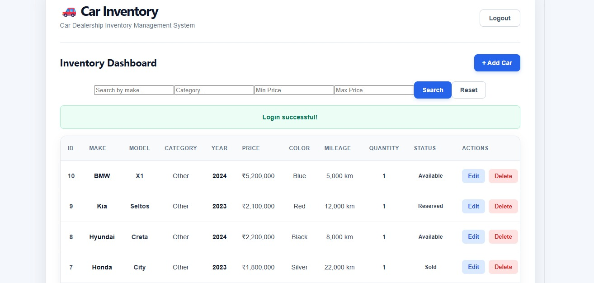
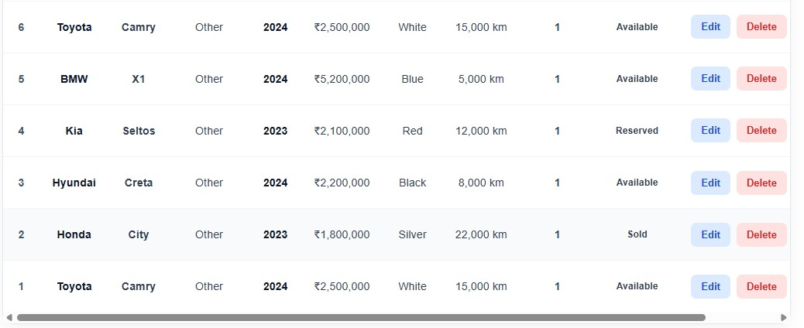
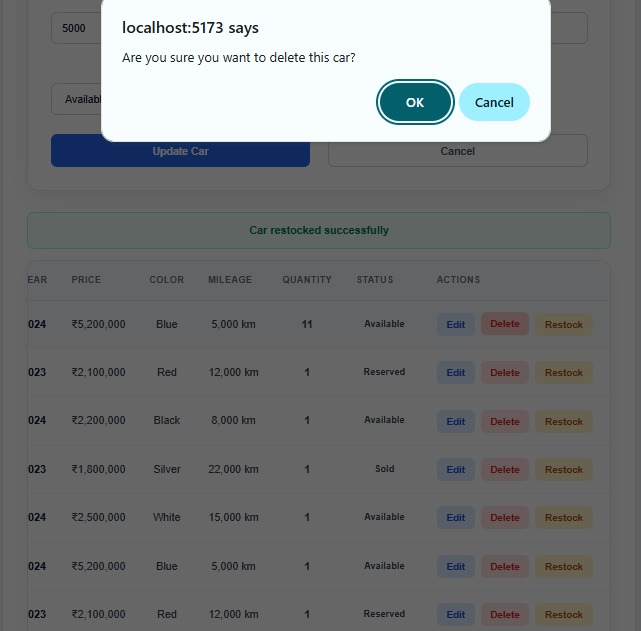
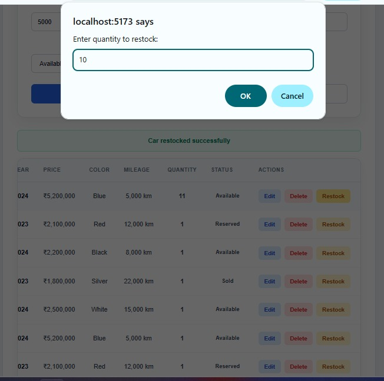

# Car Dealership Inventory Management System

A full-stack web application for managing a car dealership inventory with role-based authentication and inventory operations.

## Features

### Authentication

* User registration and login
* JWT-based authentication
* Password hashing with bcrypt
* Role-based access control

### Admin

* Add new cars
* Edit car details
* Delete cars
* Restock inventory
* View inventory

### User

* View available cars
* Search and filter cars
* Purchase cars
* View inventory quantity and status

### Inventory

* Make
* Model
* Category
* Year
* Price
* Color
* Mileage
* Quantity
* Status

## Technology Stack

### Frontend

* React
* TypeScript
* Vite
* CSS

### Backend

* Node.js
* Express
* TypeScript
* JWT
* bcrypt

### Database

* PostgreSQL

### Testing

* Jest
* Supertest

## API Endpoints

### Authentication

* `POST /api/auth/register`
* `POST /api/auth/login`
* `GET /api/auth/profile`

### Cars

* `GET /api/cars`
* `GET /api/cars/search`
* `POST /api/cars`
* `PUT /api/cars/:id`
* `DELETE /api/cars/:id`
* `POST /api/cars/:id/purchase`
* `POST /api/cars/:id/restock`

## Running the Project

### Backend

```bash
cd backend
npm install
npm run dev
```

Backend runs on:

```text
http://localhost:5000
```

### Frontend

```bash
cd frontend
npm install
npm run dev
```

## Testing

Run backend tests with:

```bash
cd backend
npm test -- --runInBand
```

All implemented tests are passing.
## Screenshots

### Login Page


### Admin Dashboard


### Add Car


### Inventory


### Inventory Search / Filter


### Admin Delete


### Admin Restock


## Project Highlights

* Secure JWT authentication
* Admin and user role separation
* PostgreSQL database integration
* RESTful APIs
* Inventory CRUD operations
* Search and filtering
* Purchase and restocking functionality
* Automated backend testing
